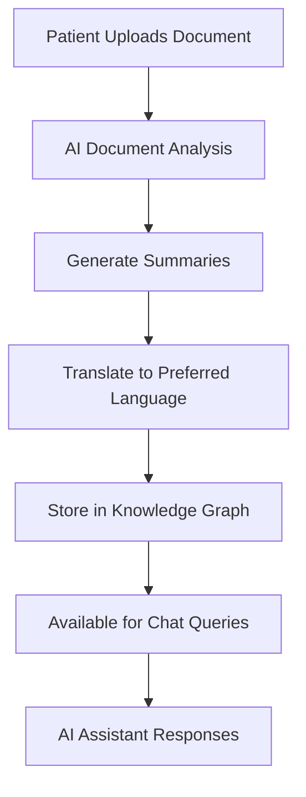

# 🏥 PharmaNoHarma
**Breaking Language Barriers in Healthcare with AI-Powered Medical Records**

[](https://yourusername.github.io/pharma_no_harma)
[](https://python.org)
[](https://fastapi.tiangolo.com)
[](https://aws.amazon.com/bedrock/)
[](https://sarvam.ai/)

---

## 🎯 What Problem Does PharmaNoHarma Solve?

### The Healthcare Communication Crisis
Millions of patients in India struggle to understand their medical information due to:

- **🌐 Language Barriers**: Medical records are primarily in English, but patients speak 22+ official languages
- **📋 Complex Medical Jargon**: Technical terminology confuses patients about their health conditions
- **🤝 Communication Gaps**: Language differences lead to misunderstood diagnoses and poor treatment compliance

### Our Solution
PharmaNoHarma transforms healthcare accessibility by providing:
- **AI-powered medical summaries** in patient-friendly language
- **Multi-language support** for 11+ Indian languages
- **Intelligent chat assistant** for medical queries
- **Smart document processing** for medical files

---

## ✨ Key Features

### 🤖 AI Medical Assistant
Intelligent chat interface that helps patients understand their medical records, medications, and health information through natural language conversations.

### 🌍 Multi-Language Support
- Supports 11+ Indian languages (Hindi, Tamil, Telugu, Bengali, and more)
- Automatic translation of medical summaries
- Real-time language switching

### 📋 Dual Summary System
- **Patient-Friendly Summaries**: Complex medical information explained in simple terms
- **Medical Summaries**: Detailed clinical information for healthcare providers

### 📁 Smart Document Processing
- AI-powered analysis of medical documents, lab reports, prescriptions
- Automatic categorization and summary generation
- Support for PDF, DOCX, images, and more

### 💊 Medicine Information Database
- Comprehensive drug information lookup
- Side effects and usage instructions
- Available in multiple languages

### 🔒 Privacy & Security
- Enterprise-grade security
- Data encryption and privacy controls
- HIPAA-compliant architecture

---

## 🚀 Quick Start

### For End Users

1. **Access the Web Interface**:
   ```bash
   # Clone and run the application
   git clone https://github.com/yourusername/pharma_no_harma.git
   cd pharma_no_harma
   pip install -r requirements.txt
   streamlit run streamlit_app.py
   ```

2. **Open your browser** to `http://localhost:8501`

3. **Start using the features**:
   - Upload medical documents
   - Chat with the AI assistant
   - Set your preferred language
   - View translated summaries

### For Developers

<details>
<summary>🔧 Development Setup</summary>

#### Prerequisites
- Python 3.8+
- Neo4j Database
- AWS Account with Bedrock access
- Redis (for background tasks)

#### Installation
```bash
# Clone repository
git clone https://github.com/yourusername/pharma_no_harma.git
cd pharma_no_harma

# Install dependencies
pip install -r requirements.txt

# Set up environment
cp env.example .env
# Edit .env with your configuration

# Initialize database
python init_db.py

# Start backend API
python run.py

# Start Streamlit UI (in another terminal)
streamlit run streamlit_app.py
```

#### Environment Configuration
```env
# Neo4j Configuration
NEO4J_URI=bolt://localhost:7687
NEO4J_USERNAME=neo4j
NEO4J_PASSWORD=password

# AWS Bedrock
AWS_ACCESS_KEY_ID=your_aws_access_key
AWS_SECRET_ACCESS_KEY=your_aws_secret_key
AWS_REGION=us-east-1

# Translation Services
SARVAM_API_KEY=your_sarvam_key

# Background Tasks
CELERY_BROKER_URL=redis://localhost:6379
```

</details>

---

## 🎮 Demo & Usage

### 💬 AI Chat Examples

**Patient Query**: "What's my latest prescription?"
**AI Response**: Provides medication details, dosage, and instructions in the patient's preferred language.

**Patient Query**: "Explain my blood test results"
**AI Response**: Breaks down complex lab values into understandable explanations.

### 🌐 Language Translation

**Original (English)**: "Take 500mg of Metformin twice daily with meals for diabetes management."
**Hindi Translation**: "मधुमेह प्रबंधन के लिए भोजन के साथ दिन में दो बार 500mg मेटफॉर्मिन लें।"

### 📄 Document Processing

Upload a prescription → Get instant summary → View in your language → Chat about medications

---

## 🏗️ Architecture

### Technology Stack

| Component | Technology | Purpose |
|-----------|------------|---------|
| **AI Engine** | AWS Bedrock (Claude, Titan) | Medical text analysis and chat |
| **Knowledge Graph** | Neo4j | Complex medical relationships |
| **Translation** | Sarvam AI | Indian language translation |
| **Backend API** | FastAPI | High-performance REST API |
| **Frontend** | Streamlit | Interactive web interface |
| **Task Queue** | Celery + Redis | Background processing |
| **Document Parsing** | LlamaParse | Medical document extraction |

### System Flow


---

## 📊 Impact & Benefits

### For Patients
- ✅ **Better Understanding**: Medical information in native language
- ✅ **Improved Compliance**: Clear medication instructions
- ✅ **Empowered Decisions**: Easy access to health data
- ✅ **Reduced Anxiety**: AI assistant for immediate questions

### For Healthcare Providers
- ✅ **Better Communication**: Patients understand treatment plans
- ✅ **Reduced Miscommunication**: Clear, translated summaries
- ✅ **Time Savings**: AI handles routine information queries
- ✅ **Improved Outcomes**: Better patient compliance

### For the Healthcare System
- ✅ **Accessibility**: Healthcare information for all language speakers
- ✅ **Efficiency**: Automated summary generation
- ✅ **Quality**: Consistent, accurate medical communication
- ✅ **Scalability**: AI-powered solution for millions of patients

---

## 🗂️ Project Structure

```
pharma_no_harma/
├── 🎨 Frontend
│   ├── streamlit_app.py          # Main web interface
│   └── streamlit_chat_interface.py # Chat interface
├── 🔧 Backend API
│   ├── app/
│   │   ├── api/endpoints/        # API endpoints
│   │   ├── services/            # Business logic
│   │   ├── models/              # Data models
│   │   └── core/                # Configuration
├── 📚 Documentation
│   └── guides/                  # Detailed guides
├── 🚀 Deployment
│   ├── requirements.txt         # Dependencies
│   ├── run.py                   # Application runner
│   └── Dockerfile              # Container setup
└── 🌐 GitHub Pages
    └── index.html               # Landing page
```

---

## 🎯 Supported Languages

| Language | Code | Native Name | Status |
|----------|------|-------------|--------|
| Bengali | bn-IN | বাংলা | ✅ |
| English | en-IN | English | ✅ |
| Gujarati | gu-IN | ગુજરાતી | ✅ |
| Hindi | hi-IN | हिन्दी | ✅ |
| Kannada | kn-IN | ಕನ್ನಡ | ✅ |
| Malayalam | ml-IN | മലയാളം | ✅ |
| Marathi | mr-IN | मराठी | ✅ |
| Odia | od-IN | ଓଡ଼ିଆ | ✅ |
| Punjabi | pa-IN | ਪੰਜਾਬੀ | ✅ |
| Tamil | ta-IN | தமிழ் | ✅ |
| Telugu | te-IN | తెలుగు | ✅ |

---

## 📚 Documentation

- **[🚀 Quick Start Guide](guides/QUICK_START_AGENTIC.md)** - Get started in 5 minutes
- **[🤖 AI Architecture](guides/AGENTIC_ARCHITECTURE.md)** - Understanding the AI system
- **[💬 Chat Interface](guides/CHAT_INTERFACE_GUIDE.md)** - Using the AI assistant
- **[🌐 Translation Guide](guides/TRANSLATION_INTEGRATION.md)** - Multi-language features
- **[☁️ AWS Bedrock Setup](guides/AWS_BEDROCK_INTEGRATION.md)** - AI configuration
- **[📊 Knowledge Graph](guides/neo4j_kg_schema.md)** - Understanding data relationships

---

## 🤝 Contributing

We welcome contributions! Please see our [Contributing Guidelines](CONTRIBUTING.md) for details.

### Ways to Contribute
- 🐛 Report bugs and issues
- 💡 Suggest new features
- 🔧 Submit code improvements
- 📚 Improve documentation
- 🌐 Add language support
- 🧪 Write tests

### Development Workflow
1. Fork the repository
2. Create a feature branch (`git checkout -b feature/amazing-feature`)
3. Make your changes
4. Add tests if applicable
5. Commit your changes (`git commit -m 'Add amazing feature'`)
6. Push to the branch (`git push origin feature/amazing-feature`)
7. Open a Pull Request

---

## 📄 License

This project is licensed under the MIT License - see the [LICENSE](LICENSE) file for details.

---

## 🆘 Support & Community

- **📧 Email**: support@pharmanoharma.com
- **💬 GitHub Discussions**: [Community Forum](https://github.com/yourusername/pharma_no_harma/discussions)
- **🐛 Bug Reports**: [GitHub Issues](https://github.com/yourusername/pharma_no_harma/issues)
- **📖 Documentation**: [GitHub Wiki](https://github.com/yourusername/pharma_no_harma/wiki)

---

## 🙏 Acknowledgments

- **AWS Bedrock** for providing advanced AI capabilities
- **Sarvam AI** for Indian language translation services
- **Neo4j** for graph database technology
- **FastAPI & Streamlit** for modern development frameworks
- **Open Source Community** for inspiration and support

---

## 🌟 Star History

[](https://star-history.com/#yourusername/pharma_no_harma&Date)

---

<div align="center">

**🏥 Making Healthcare Accessible for Everyone 🏥**

Built with ❤️ for breaking language barriers in healthcare

[🌐 Visit Website](https://yourusername.github.io/pharma_no_harma) • [📖 Documentation](guides/) • [🚀 Get Started](#-quick-start)

</div> 